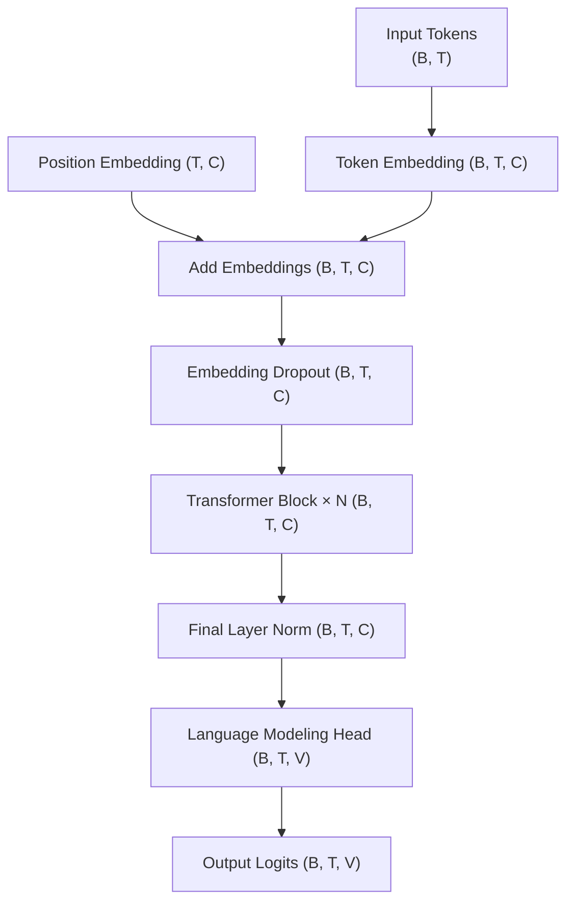
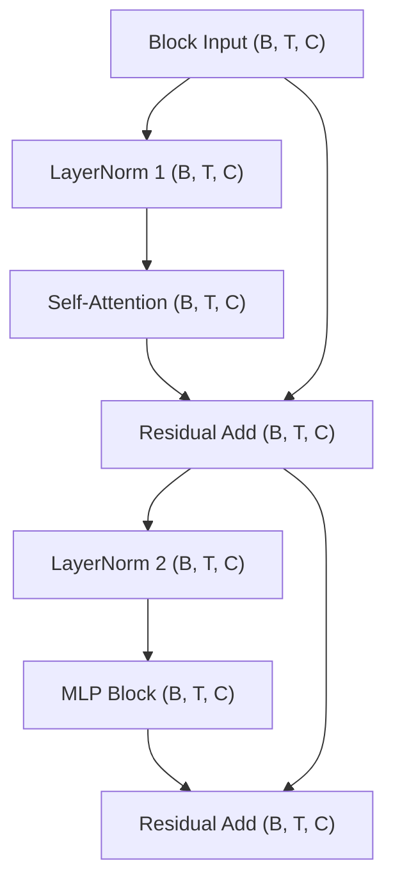
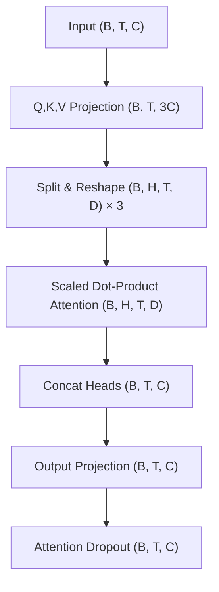
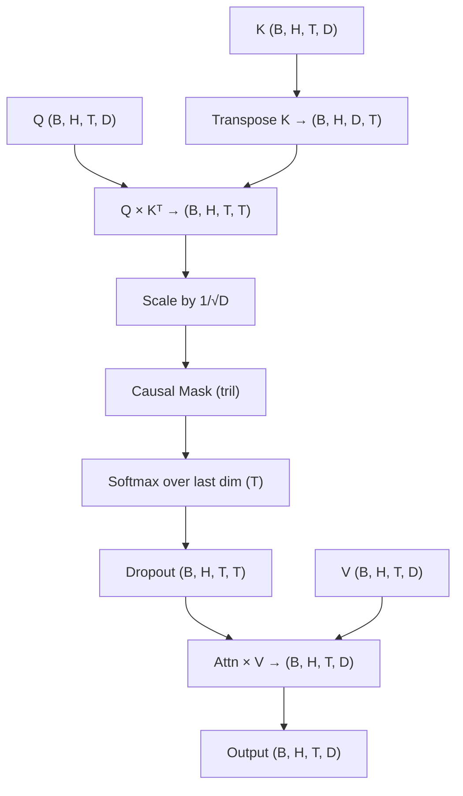
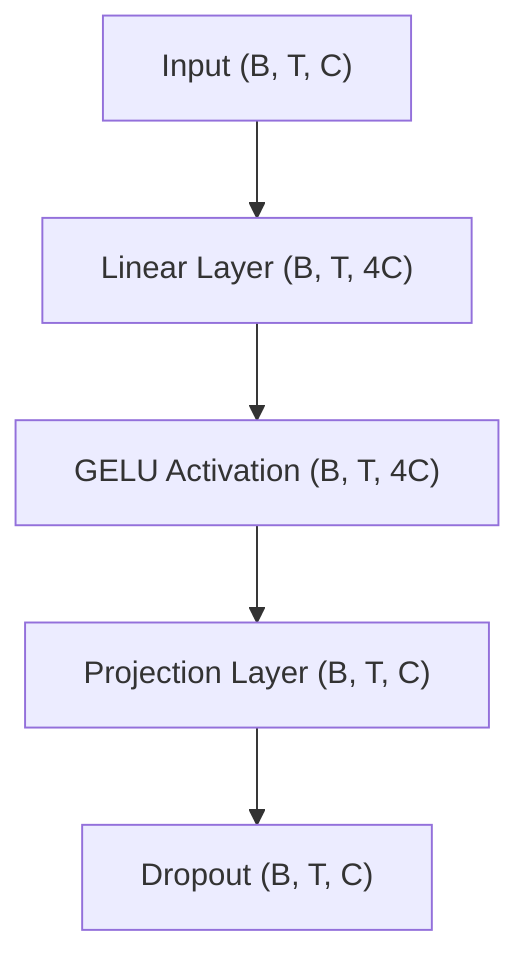

I have attempted to learn the Transformer multiple times.

When the now-classical paper [*Attention Is All You Need*](https://arxiv.org/abs/1706.03762) first came out in 2017, I was attracted by its title. That was about 5 years after the classic work [AlexNet](https://papers.nips.cc/paper_files/paper/2012/hash/c399862d3b9d6b76c8436e924a68c45b-Abstract.html), followed by rapid developments of deeper and more sophisticated models such as VGG, ResNet, Inception, and Faster R-CNN in the field of computer vision.

Around 2016–17, we were seeing a plateau in the performance improvement of vision models. Many people, including myself, thought attention might be one of the most promising directions forward. However, no one knew exactly how to make it work until *Attention Is All You Need* achieved the first major success.

However, after reading the paper for one hour, I gave up, concluding that it was a paper written by geniuses, but also for geniuses. I didn't like the use of the terms "key," "value," and "query" either. They felt too "computer sciency" to me. (I still think those are poor naming choices and framing. They obscured the genius architecture, at least for me.) I was hoping someone would propose a better and more intuitive architecture to replace the Transformer in a few years, so I wouldn't have to learn it.

This never happened. Instead, one model after another based on the Transformer achieved significant success. I did invest a bit more time and made two other small attempts when BERT and ViT came out. With the help of more intuitive materials such as the fantastic guide [*The Illustrated Transformer*](https://jalammar.github.io/illustrated-transformer/), I was able to develop a clearer understanding of the model, although not in every detail. I still had many unanswered questions.

By the end of 2022, ChatGPT was released, and everyone was shocked. I told myself, that's it—no more waiting—I need to understand everything about the Transformer now! Luckily, Andrej Karpathy created [nanoGPT](https://github.com/karpathy/nanoGPT) along with a very detailed [two-hour video](https://www.youtube.com/watch?v=kCc8FmEb1nY) explaining it. I followed the video, read the code, ran some experiments, and even created [a pull request](https://github.com/karpathy/nanoGPT/pull/254).

The problem is, I am a visual thinker. Without a diagram, I don't feel like I've learned something thoroughly, even if I understand the code line by line. Additionally, after two years of not working directly at the architecture level, I felt I quickly forgot many details about the model. I needed a diagram—a map of the code—to help me easily recall and navigate different parts of the LLM.

Therefore, I asked an LLM to create some [Mermaid diagrams](https://mermaid.js.org/) for me based on the `model.py` file in the nanoGPT repo. By the way, this is actually a good method to test an LLM's coding ability. I tried Gemini Pro 2.5, ChatGPT 4o, 4.5, o1, Gemma 3 27b, Claude 3.7 (in Copilot), and Claude 3.7 Thinking (in Copilot). The best result came from Claude 3.7. Interestingly, Gemma 3 forgot my question after reading the code. In the end, I used the diagram from Claude 3.7, edited it with ChatGPT 4.5, and did some manual adjustments.

There are 5 diagrams ranging from high-level to lower-level views. I used a top-to-bottom information flow direction, which is opposite to the original Transformer paper's diagrams, because I somehow prefer this direction, and it aligns with the "deep" concept in deep learning. I also added tensor dimensions in the blocks, with the following meanings:

- **B**: Batch size
- **T**: Sequence length (Block size, e.g., 1024)
- **C**: Embedding dimension (`n_embd`, e.g., 768)
- **V**: Vocabulary size (e.g., 50304)
- **H**: Number of attention heads (`n_head`, e.g., 12)
- **D**: Dimension per attention head (`C // H`, e.g., 64)
- **4C**: Dimension of the MLP hidden layer (e.g., 3072)

#### The High Level Model Architecture Diagram

#### Transformer Block x N

#### Self-Attention

#### Scaled Dot-Product Attention

#### MLP

