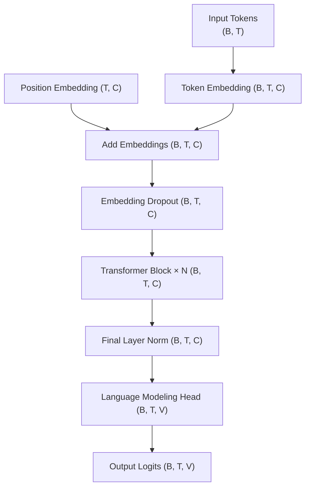
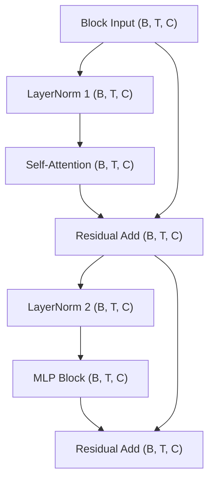
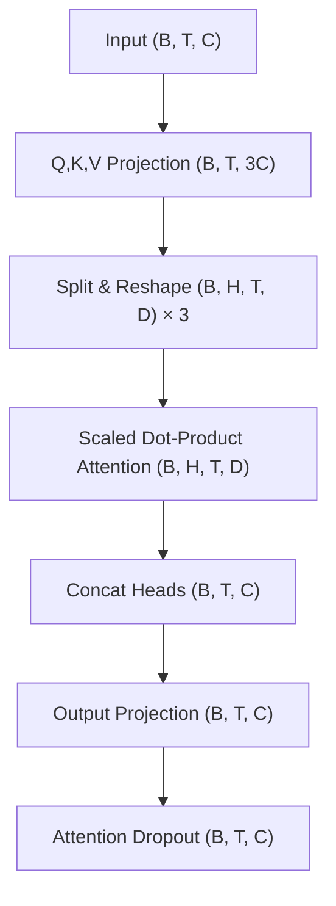
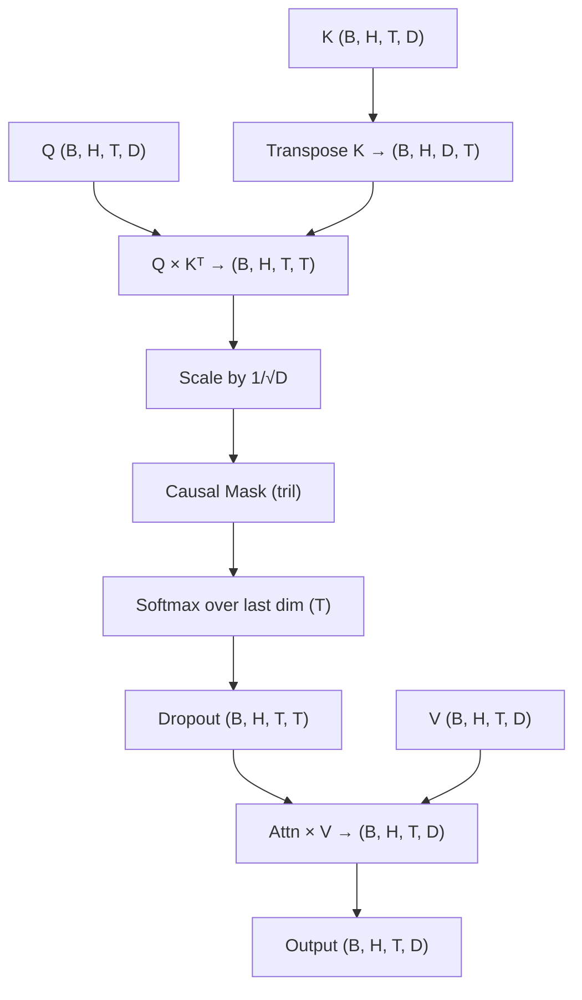
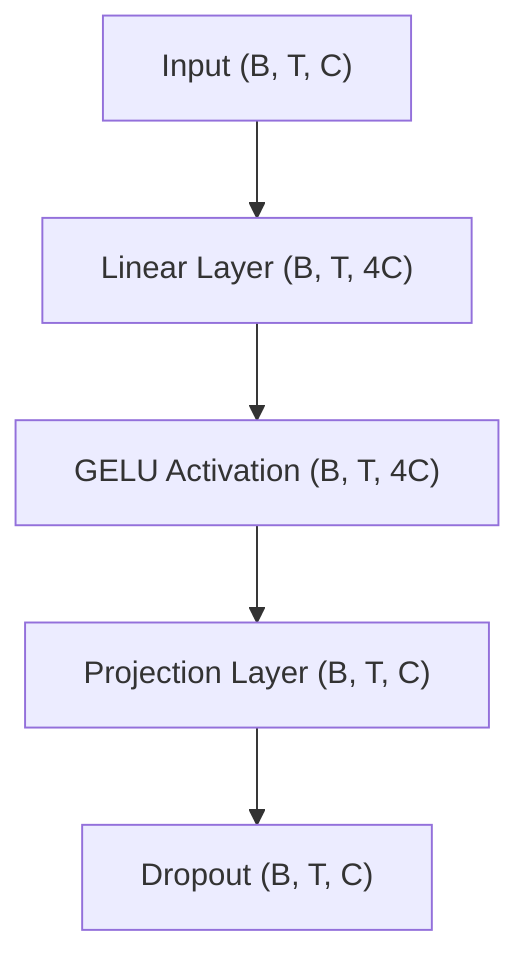

I have attempted to learn transfomer multiple times. 
When the now classical paper [*Attention Is All You Need*](https://arxiv.org/abs/1706.03762) just came out in 2017 I have attracted by the title. That's about 5 years after the classical work [AlexNet](https://papers.nips.cc/paper_files/paper/2012/hash/c399862d3b9d6b76c8436e924a68c45b-Abstract.html), followed by rapid development of deeper and more safisticated models such as VGG, ResNet, Inception and Faster R-CNN in the field of computer vision. 
Around 2016-17 were seeing the performance increasing speed of vision models reaching a plateu.
Many people including myself think attention if one of the most promissing direction to go forward.
No one knows exactly how to make it work though until *Attention Is All You Need* made the  first major success.

However, after reading the paper for one hour, I give up with the conclusion that it is a paper written by genius, but also for genius. 
I didn't like the use of the terms "key", "value" and "query" either. 
They feel too computer sciency for me. (I still think those are bad naming and framing. They obscured the genius architecture, at least to me).
I was hopping someone propose a better and more intuitive archteture to replace transfomer in a few years, so I don't have to have to learn it.

This never happend. What did happen is one model after another which based on transfomer made big success.
I did invested a bit more time and had another two small tries when BERT and ViT came out. 
Wih the help of more intuitive material 
such as the fatastic guide [*The Illustrated Transformer*](https://jalammar.github.io/illustrated-transformer/)
I was able to have a better picture of the model though not every detail. 
I still have many qestions unanswered.

By the end of 2022, ChatGPT relieased and everyone is shocked.
I told myself that's it, no more waiting, understand everything about transformer now!
Luckily Andrej Karpathy created the [nanoGPT](https://github.com/karpathy/nanoGPT) together with a very detailed [two hour video](https://www.youtube.com/watch?v=kCc8FmEb1nY) to explain it.
I followed the video, read the code, run some experiments, and even created [a pull request](https://github.com/karpathy/nanoGPT/pull/254).

The problem is I am a visual thinker, without a diagram I don't feel I have learned it even though I understand the code line by line. Beside after two years not working directly on the architeture level I feel I quickly forgot lots of things about the model. I need a diagram, a map of the code to help me to easily recall and navigate different parts of the LLM.

Therefore, I asked LLM to create some [mermaid diagrams](https://mermaid.js.org/) for me based on the `model.py` file in nanoGPT repo.
It is actually a good way to test the LLM's coding ability by the way.
I have tried Gemini Pro 2.5, ChatGPT 4o, 4.5, o1, Gemma 27b, Claudia 3.7 (in copilot), Claudia 3.7 thinking (in copilot). The best result is from Claudia 3.7. Interestingly, Gemma 3 forget my question after reading the code.  In the end I used the diagram from claudia 3.7 and edited with chatgpt 4.5 and manually.

There are 5 diagrams from high level to lower levels. 
I used top to down information flow direction, which is the opposite of the diagram in the original  transformer paper, because I somehow like it better and it aligns with "deep" as in deep learning.
I also add tensor dimensions in the blocks with the following meaning:

- **B**: Batch size
- **T**: Sequence length (Block size, e.g., 1024)
- **C**: Embedding dimension (`n_embd`, e.g., 768)
- **V**: Vocabulary size (e.g., 50304)
- **H**: Number of attention heads (`n_head`, e.g., 12)
- **D**: Dimension per attention head (`C // H`, e.g., 64)
- **4C**: Dimension of the MLP hidden layer (e.g., 3072)

#### The High Level Model Architecture Diagram

#### Transformer Block x N

#### Self-Attention

#### Scaled Dot-Product Attention

#### MLP

